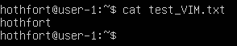
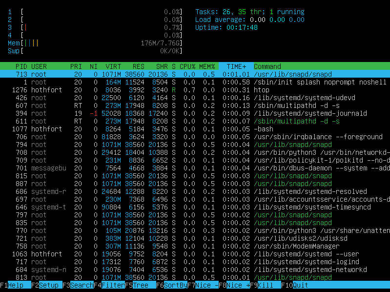
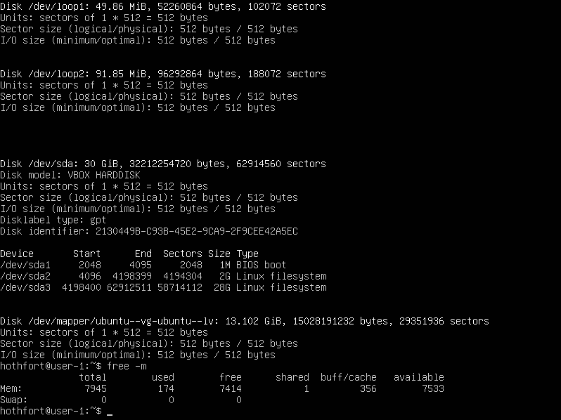
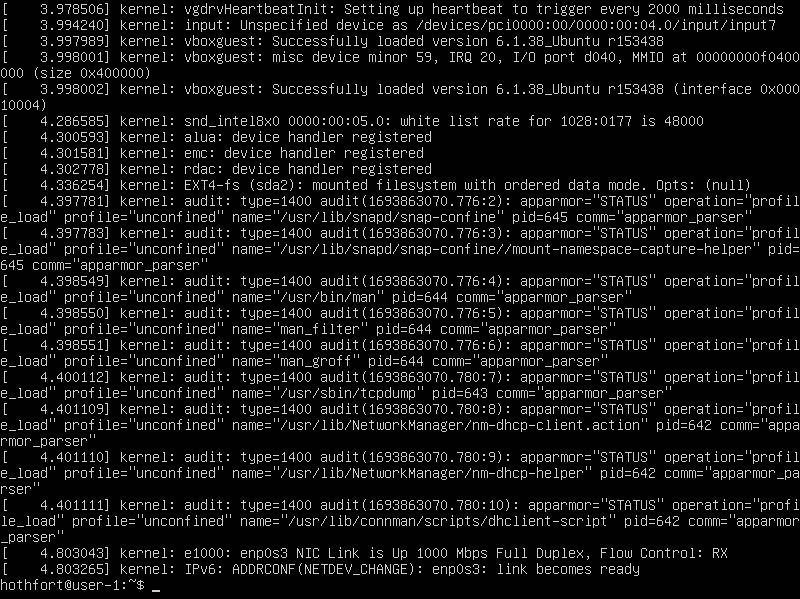

## Part 1. Установка ОС

- Узнайте версию Ubuntu, выполнив команду cat /etc/issue.

## Part 2. Создание пользователя

- Вызов команды для создания пользователя.

- Вызов команды для просмотра пользователей.

## Part 3. Настройка сети ОС

- Новое имя машины.

- Установка временной зоны.

- Вывод названий сетевых интерфейсов.

> Lo (loopback device) – виртуальный интерфейс, присутствующий по умолчанию в любом Linux. Он используется для отладки сетевых программ и запуска серверных приложений на локальной машине. С этим интерфейсом всегда связан адрес 127.0.0.1.

> DHCP - Dynamic Host Configuration Protocol
- Вывод IP - адреса устройства.

- Вывод внешнего и внутреннего IP-адреса шлюза.

- Задание статичных настроек ip, gw, dns.

- После перезагрузки.

- Пропинговка хостов.

## Part 4. Обновление ОС

- Проверка отсутствия обновлений.

## Part 5. Использование команды **sudo**

> Sudo — это утилита, предоставляющая привилегии root для выполнения административных операций в соответствии со своими настройками.

- Добавление пользователя в группу с привилегиями sudo.

- Изменение hostname.

## Part 6. Установка и настройка службы времени

- Вывод корректного времени.

## Part 7. Установка и использование текстовых редакторов 

- Содержимое перед закрытием (vim)

> Выход с сохранением: Esc, :, wq

- Содержимое перед закрытием (nano)

> Выход с сохранением: CTRL+0, CTRL+x

- Содержимое перед закрытием (mcedit)

> Выход с сохранением: F2, F10

- Содержимое после редактирования (vim) 

> Выход без сохранения: Esc, :, q

- Вывод файла.

- Содержимое после редактирования (nano)

> Выход без сохранения: CTRL+x, n

- Вывод файла.

- Содержимое после редактирования (mcedit)

> Выход без сохранения: F10

- Вывод файла.

> Поиск в vim через: /

- Результат поиска (vim)

- Команда для замены (vim)

- Результат поиска (nano)

- Команда для замены (nano)

- Результат поиска (mcedit)

- Команда для замены (mcedit)

## Part 8. Установка и базовая настройка сервиса **SSHD**

- Установка SSHd (sudo apt install openssh-server).
- Добавление в автозагрузку (sudo systemctl enable sshd)
- Перенастройка SSHd на порт 2022 (sudo vim /etc/ssh/sshd_config)

- С помощью ps -C sshd показать наличие процесса sshd.

> Ключ -C выбирает процесс по названию

- Вывод netstat -tan.

- -t отображает только TCP соединения
- -a вывод всех подключений
- -n вывод активных подключений TCP с отображением адресов и номеров портов в числовом формате
- Proto - название протокола (протокол TCP или протокол UDP)
- recv-Q - очередь получения сети
- send-Q - сетевая очередь отправки
- Local Address - адрес локального компьютера
- Foreign Address - адрес удаленного компьютера
- State - состояние сервера
- 0.0.0.0 - означает IP-адрес на локальной машине

## Part 9. Установка и использование утилит **top**, **htop**

- По выводу команды top определить:

- uptime: 0:13
- количество авторизованных пользователей: 1
- общая загрузка системы: 0,02, 0,01, 0,00
- общее кол-во процессов: 117
- загрузка CPU: 0.0
- загрузка памяти: 173.8 M
- pid процесса занимающего больше всего памяти: 713

- pid процесса, занимающего больше всего процессорного времени: 1257

- Вывод htop, отсортированный по PID, PERCENT_CPU, PERCENT_MEM, TIME

- Вывод htop, отфильтрованный для sshd

- Вывод htop с процессом syslog, найденным, используя поиск

- Вывод htop с добавленными hostname, clock, uptime

## Part 10. Использование утилиты **fdisk**

- Вывод fdisk -l

- Название: VBOX HARDDISK
- Размер: 30Gib
- Кол-во секторов: 62914560
- Размер swap: 0G

## Part 11. Использование утилиты **df** 

- Вывод df

- Размер раздела: 14339080
- Размер занятого пространства: 2579368
- Размер свободного пространства: 11009532
- Процент использования: 19%

- Вывод df -Th

- Размер раздела: 12G
- Размер занятого пространства: 14G
- Размер свободного пространства: 2.5G
- Процент использования: 19%
- Тип файловой системы: ext4

## Part 12. Использование утилиты **du**

- Вывод  du

- Вывод  du /home

- Вывод  du /var

- Вывод  du /var/log

- Вывод  du /var/log/*

## Part 13. Установка и использование утилиты **ncdu**

- Вывод ncdu /home

- Вывод ncdu /var

- Вывод ncdu /var/log

## Part 14. Работа с системными журналами

- Просмотр /var/log/dmesg

- Просмотр /var/log/syslog

- Просмотр /var/log/auth.log

- Последняя авторизация: Sep 5 01:18:18 hothfort by LOGIN
- Перезапуска службы SSHd

## Part 15. Использование планировщика заданий **CRON**

- Запуск задачи

- Информация о выполнении

- Список после удаления задачи

